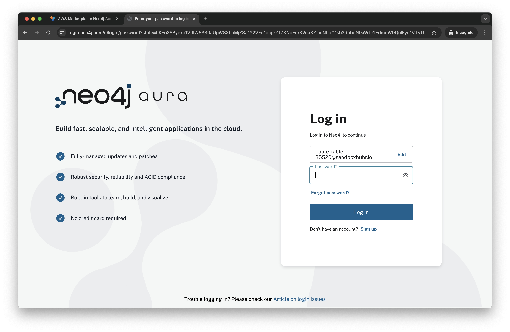
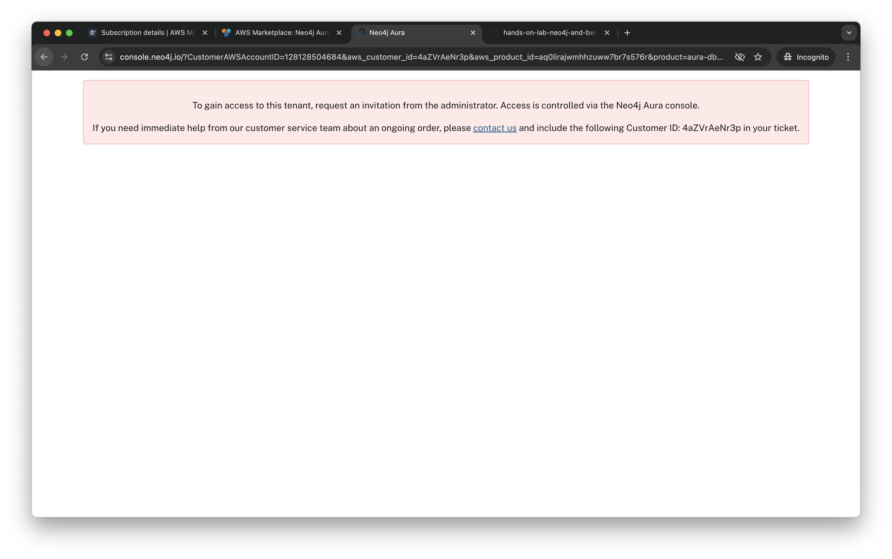
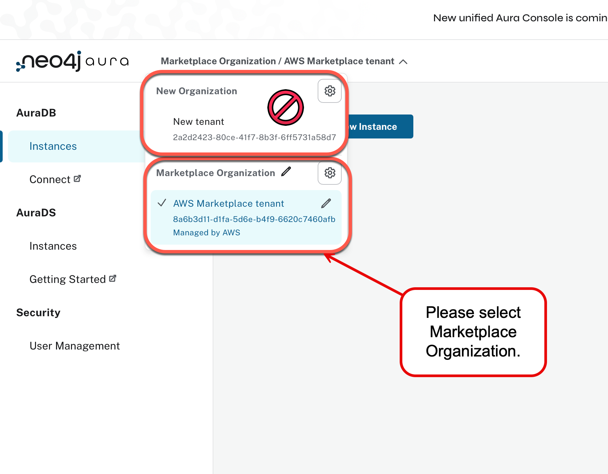
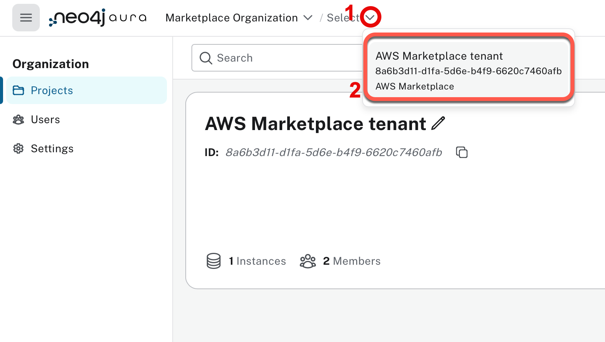
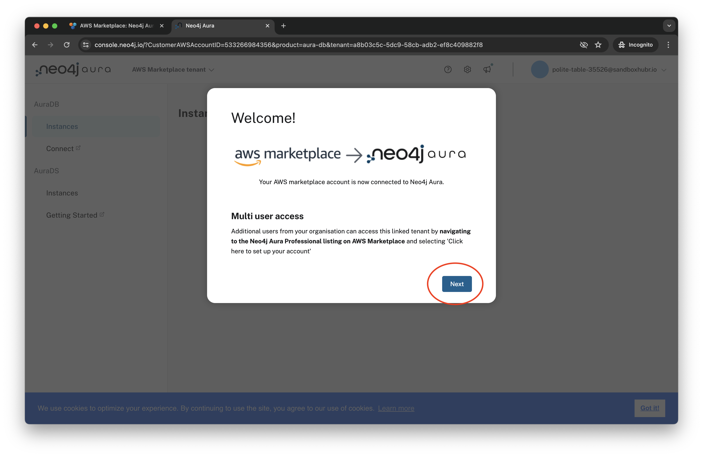
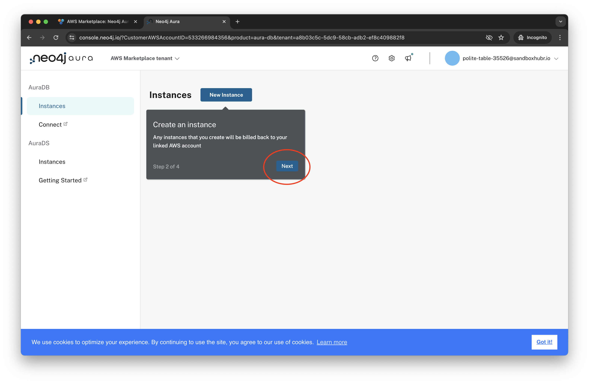
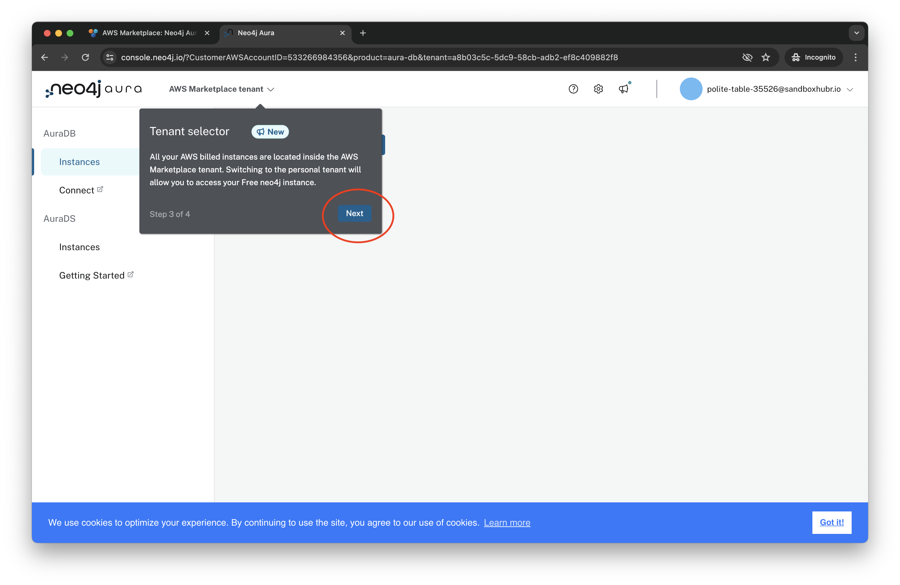
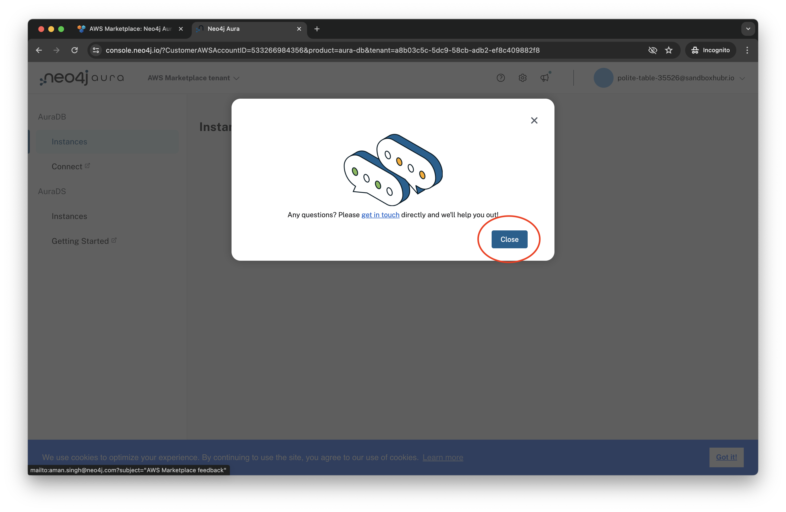
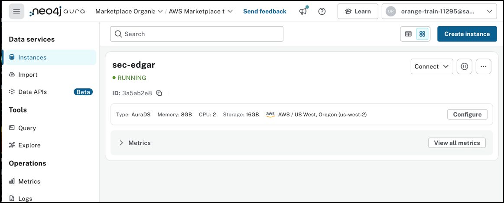

# Lab 1 - Deploy Neo4j
Neo4j has three major products:
* Graph Database - a native graph database built from the ground up to leverage not only data but also the relationships in that data
* Graph Data Science - implementations of 70+ algorithms that can be run on graphs stored in the database
* Bloom - a Business Intelligence (BI) tool designed specifically to explore graphs

There are many ways to run these products on AWS.  The Marketplace in particular offers two ways to deploy Neo4j:

* Software as a Service (SaaS) - Neo4j Aura is the lowest effort way to deploy Neo4j.  Infrastructure is managed entirely for you.  Aura is available in AuraDB (Database) and AuraDS (Data Science) versions.  DB is the core database.  DS includes Bloom for Business Intelligence and Neo4j Graph Data Science.
* Infrastructure as a Service (IaaS) - Neo4j Enterprise Edition is available on IaaS with an AWS CloudFormation Template (CFT).  That allows you to choose whether you would like a single node or cluster.  It allows deployment of Graph Database, Bloom and Graph Data Science.

## Deploying AuraDS Professional
We're going to use the SaaS version, AuraDS, in these labs.  This is sometimes refered to as a database as a service (DBaaS).  Aura comes in a number of flavors.  There's an enterprise and a professional version.  We're going to deploy the professional version.  

So, let's get started deploying...  To do so, let's open the seller profile [here](https://aws.amazon.com/marketplace/seller-profile?id=23ec694a-d2af-4641-b4d3-b7201ab2f5f9).

Scroll down and select "Neo4j Aura Professional."

Click "View purchase options."

Note that this account has already been subscribed to Neo4j Aura Professional.  Click on "Vendor's website"

This takes us to the Neo4j Aura console.  Billing information has been passed over from the AWS account we just came from.  Under "Already have an account?" click "Log in."

Enter the email address provided for this lab.  In my case, it was kind-wind-34940@sandboxhubr.io.  Click "Log in."

Now enter the password provided for that email address.  Click "Log in."

**NOTE: IF YOU GET THE FOLLOWING ERROR SCREEN, take the following 2 steps:*** 

a. Click the "Back" button or refresh the screen**

b. Be sure the "AWS Marketplace" tenant is selected from the dropdown menu on the upper left side of the screen**

IF you are using the latest Aura console, please select the AWS Marketplace tenant as below:

You'll be presented with a splash screen.  Click "Next."

Click "Next" to advance to the next dialog.

Click "Next" to advance to the next dialog.

Click "Close" to exit the dialog.

Click "Got it" to dismiss the bottom menu.

In the menu on the left click on "Instances" under "Aura DS."  Important -- be absolutely certain to select AuraDS.  It has components like Graph Data Science that AuraDB does not.  We're going to need those later.

Click "New instance."

Once again, make sure the tenant is set to "AWS Marketplace" from the dropdown menu on the upper left. 

Scroll down and for "Number of nodes" enter 500,000.  For number of relationships, enter "1,000,000."  This will ensure our AuraDS deployment is of sufficient size for our workload.  

For algorithms select "Node Embedding."  This item doesn't change the config, rather is a survey of what algorithms users are making use of.

With all that done, click "Calculate Estimate."

For instance name, let's put "sec-edgar."  Click "Create."

You'll be presented with the credentials for your database.  Click "Download and continue."  That will download the credentials to a text file on your local machine.  Be sure to save that file as you won't be able to get those credentials later.

You'll see a dialog that your database is being created.  This takes less than five minutes.

When deployment is complete you'll see this menu.  

You can poke around the menus here a bit and see more on database status and connection information.

You now have a deployment of Neo4j running!  In the next lab, we'll connect to it.

