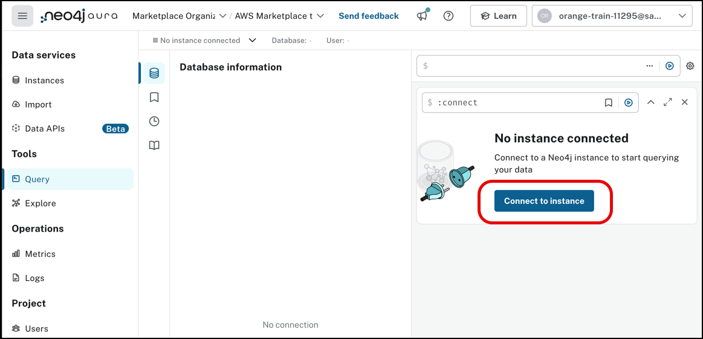
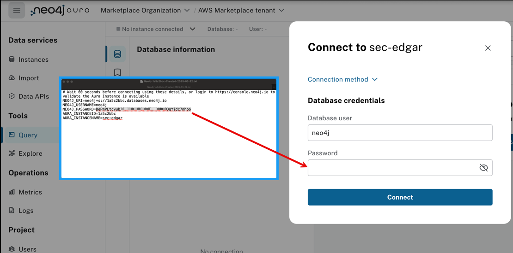

# Lab 2 - Connect to Neo4j
In this lab, we will connect to the Neo4j database created in the previous step. To begin, click the "Connect to Instance" button.



Upon clicking **"Connect to Instance"**, a pop-up window will appear, showing the instance you created in **Lab 1**. Now, click **"Connect"**.


You'll now need to provide your password.  You can find that in the file we downloaded earlier.  



The standard NEO4J_USERNAME is neo4j.  

Enter your password and click "Connect."

Note that the connection to the database is being made over port 7687.  If you have a firewall running on your laptop, or a VPN, it's quite possible that will block this connection.  To continue you will need to disable that.

## Neo4j Aura - Working with Graph Data  

We are now in **Neo4j Aura Console**, a unified experience for working with graph data. The interface includes several sections:  

- **Import** – Located under **Data Services**, this opens the **Neo4j Data Importer**, a graphical tool for importing data into Neo4j.
- **Explore** – Powered by **Neo4j Bloom**, this is a graph exploration tool for visually interacting with graph data..
- **Query** – Opens the **Neo4j Query Editor**, where you can run Cypher queries and inspect results.

## Getting Started with Query  

Let's start with **Query**, which should already be open.  

Currently, the database is empty. The **Nodes**, **Relationships**, and **Property Keys** sections confirm this.  

## Running Your First Cypher Command  

**Cypher** is Neo4j's query language. Let's run our first Cypher command to check the version of **Neo4j Graph Data Science (GDS)**:  

```cypher
RETURN gds.version() AS version
```


This command should return the current GDS version. If you encounter any errors, it means you have created the wrong instance of Aura. Please start over from Lab 1 to create the correct AuraDS instance.


Since we got a Graph Data Science version back, we know that we're on AuraDS, not AuraDB.  This means that we have the libraries we'll need to connect with the Python client and use graph algorithms later in these labs.

Assuming that all looks good, let's move on...

#### Progress:  ██░░░░░ 2/7 Labs Completed!
