# Lab 4 - Exploration
In this lab, we'll use Bloom, Neo4j's business intelligence (BI) tool, to explore our data.

## Exploration with Neo4j Bloom
To open Bloom, go to the Neo4j Aura Console and click "Open" as in Lab 2.  From there, make sure the "Explore" tab at the top is selected.

Perspectives in Bloom define a specific business view or domain from the target Neo4j graph. A single Neo4j graph can be viewed through different perspectives, each tailored for a different business purpose.

Click the slider icon in the upper left to open the perspective menu.

Now click the refresh icon to refresh the perspective.  This pulls the latest data model from our database.  Click "Refresh" to agree to refresh the perspective.

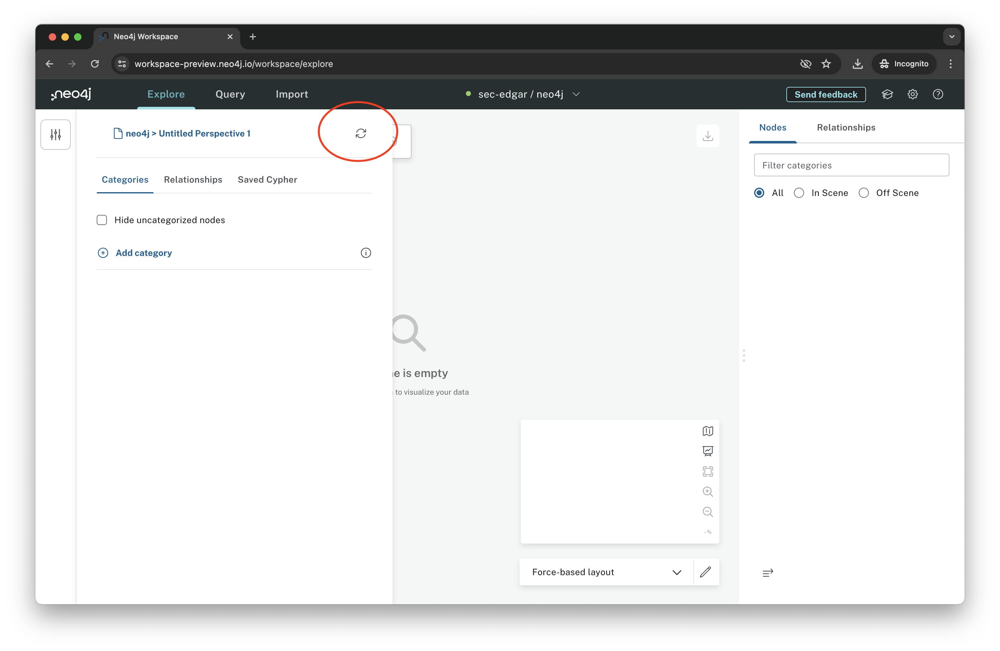

Click the "Refresh" button to continue.

When that is complete, select "Add category" in the perspective menu. 

You should see a pop-up with the node labels in the database. Select "Company."  

Now, let's repeat the process for "Company." Click on the slider menu again.

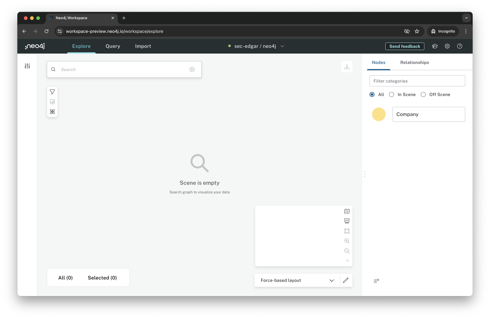

Click on "Add category."

Click on "Manager."

Click on the perspective button to dismiss the menu.

When that is complete, you should see labels for Manager and Company.

Now that our perspective is refreshed with updated labels, we're ready to start exploring.

The easiest way we can explore data in Bloom is to have it generate a view for us.  To do so, click in the search bar.

Now click on "Show me a graph."  Hit enter.

In this case, we got a view with a two company nodes at the center and 100+ managers that own shares of that company.

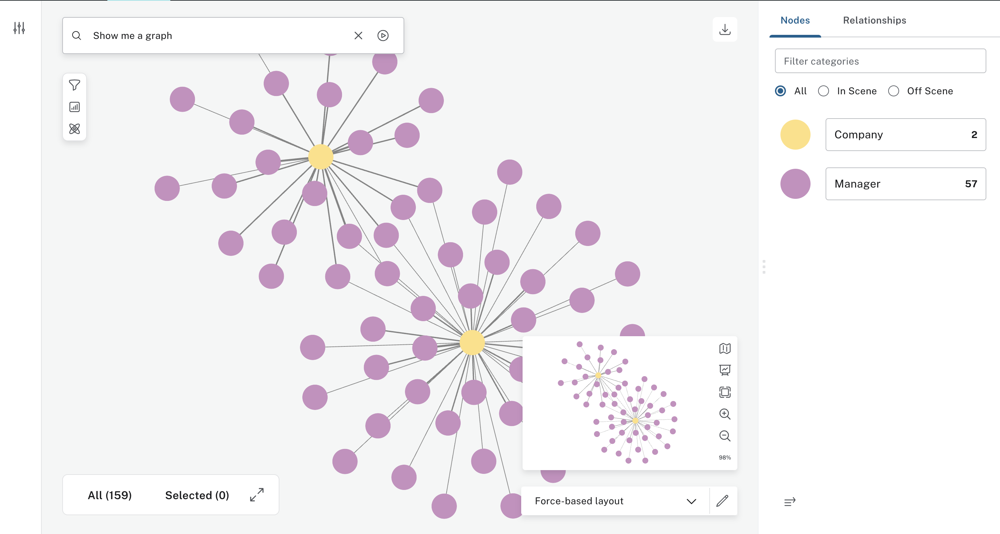

We can click on the company to see its name.

Now let's try finding a new graph.  Click on the X in the search bar to clear the contents of it.  

Then click in the search bar

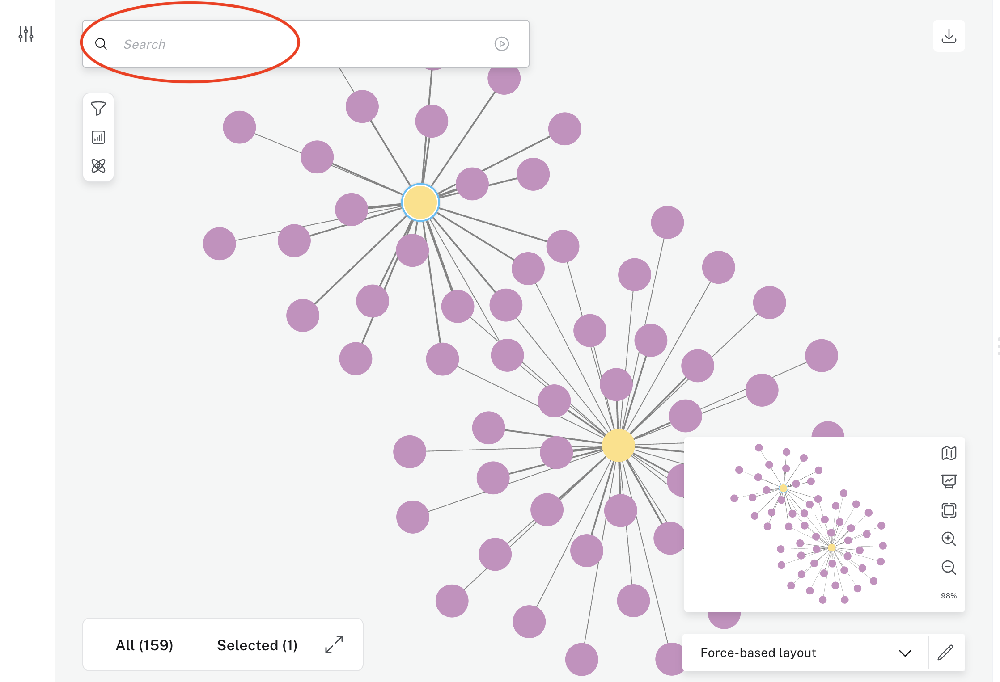

Select "Manager."

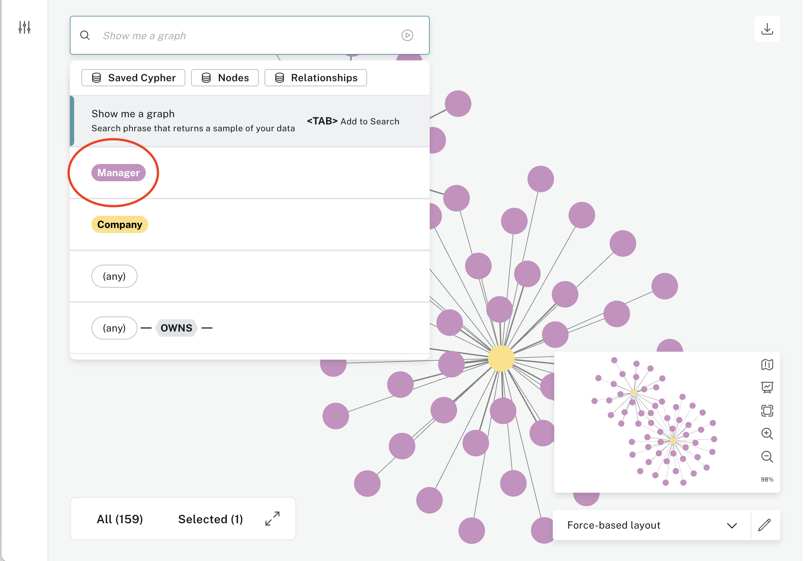

Now select "OWNS."

Now select "Company" 
 

Now hit either hit enter or press the play button.

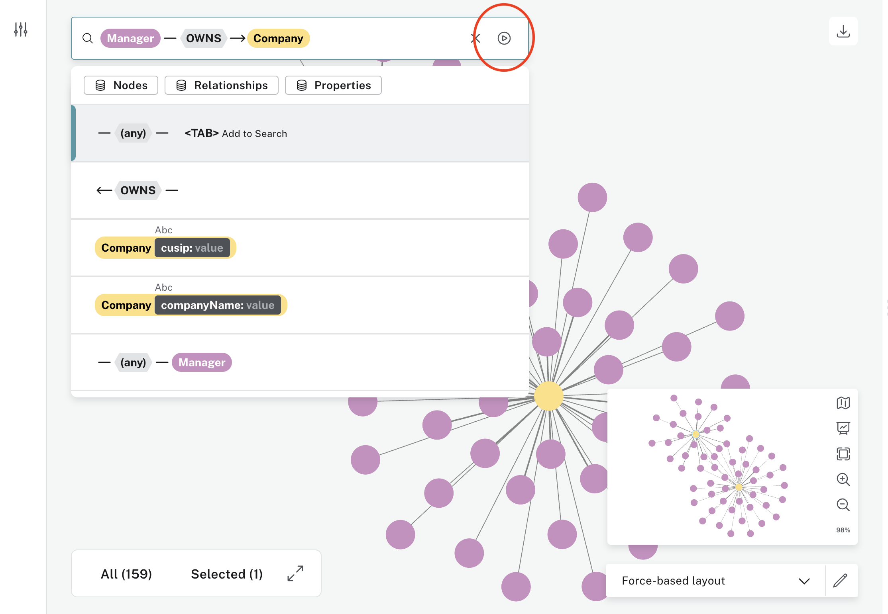

That gives us search results for paths that go from Manager to Company.  We hit a limit of 1000, so it's not visualizing everything.

Next, we will apply some point-and-click data science to our graph.  Click on the atom icon to open the data science menu.

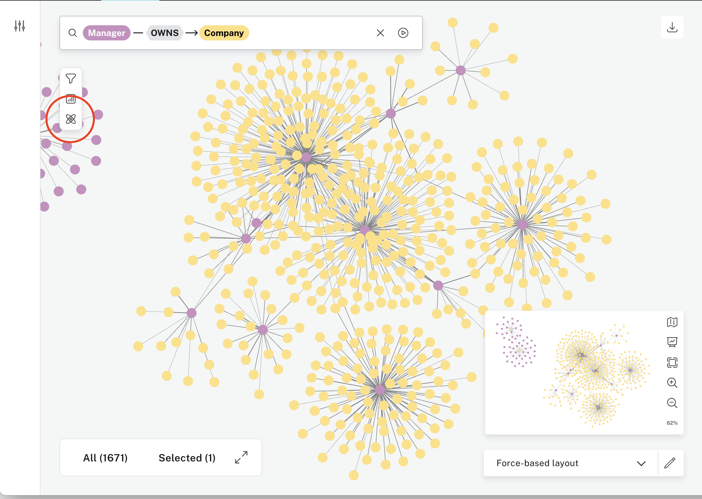

Click "Add algorithm."

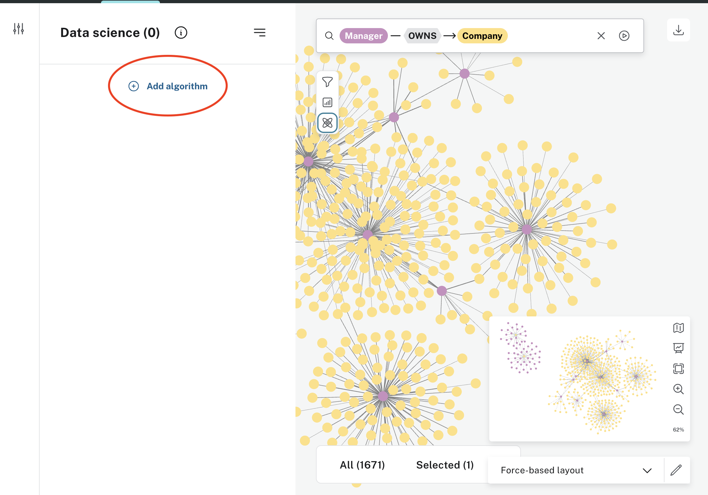

Open the drop down menu.

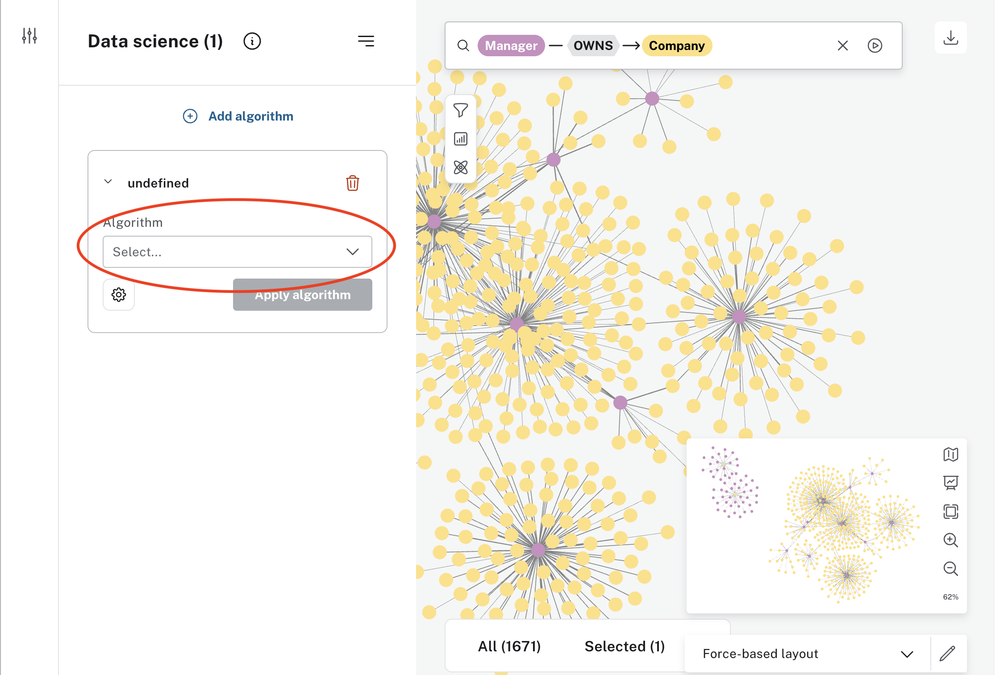

Select "Degree Centrality."

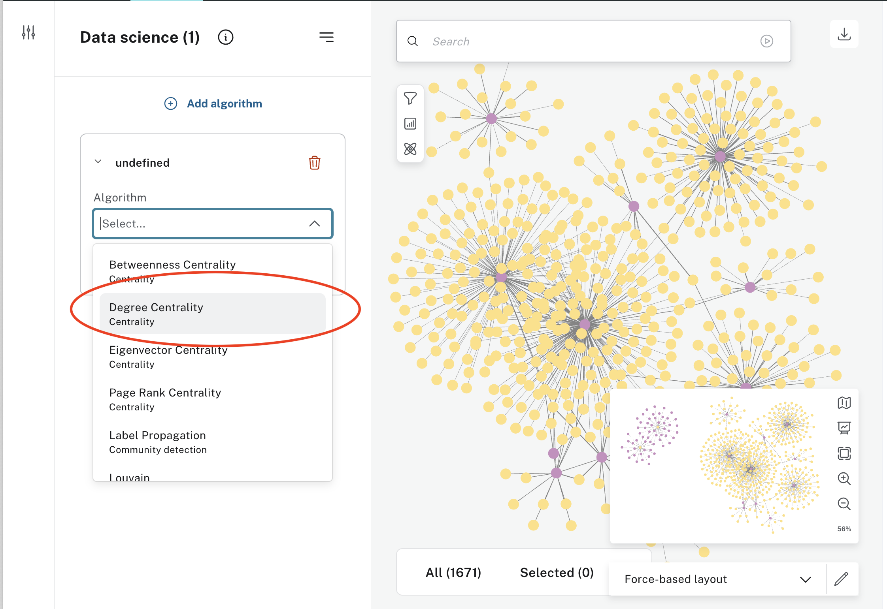

Click "Apply."

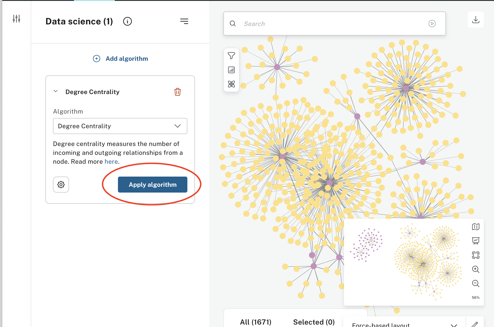

That gives us this.

Now that we've run the algorithm, we can choose how we want to visualize the results in the graph.  

Choose "Size scaling."

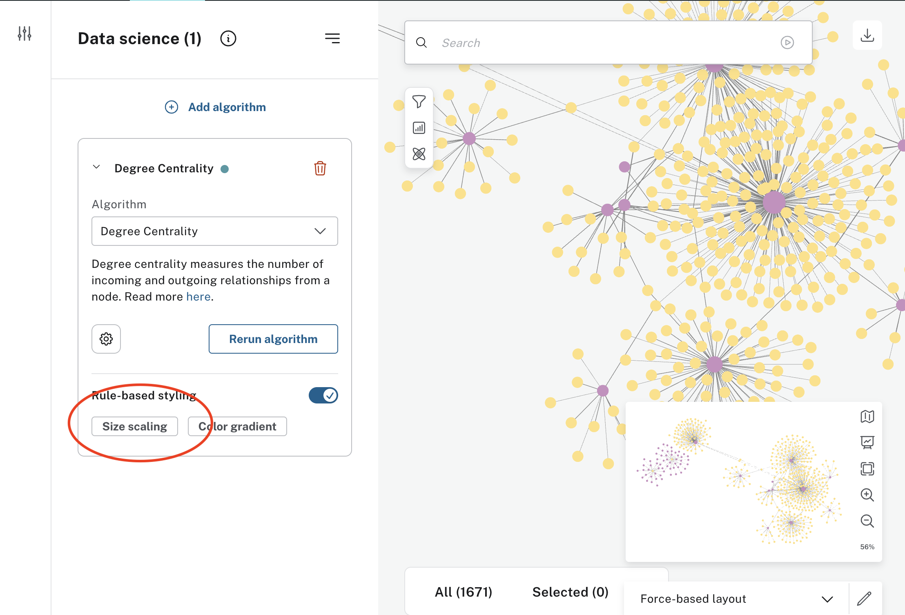

The more central nodes in our graph are now shown as larger. 

These are just a few examples of what you can do with Bloom.  Feel free to explore!

#### Progress:  ████░░░ 4/7 Labs Completed!