# Lab 5 - Parsing Data
In this lab we're going to spin up a SageMaker domain.  We'll then use it to run a notebook that calls Neo4j and Amazon Bedrock APIs to load data into Neo4j.

## Create a SageMaker Domain
The first step is to deploy a SageMaker domain.  To do that, open the AWS console [here](https://console.aws.amazon.com/).  In the search bar, type "sagemaker." 

From the search results, click on "SageMaker Studio" under "Amazon SageMaker AI." 

A SageMaker Domain is a container for notebooks and other artifacts deployed within SageMaker.  It can be deployed to be shared across an entire data science department.  However, for our uses, we only need a single user.

To that end, click "Set up for single user."

You'll see a message that setup is in progress.

Then you'll be redirected into SageMaker.

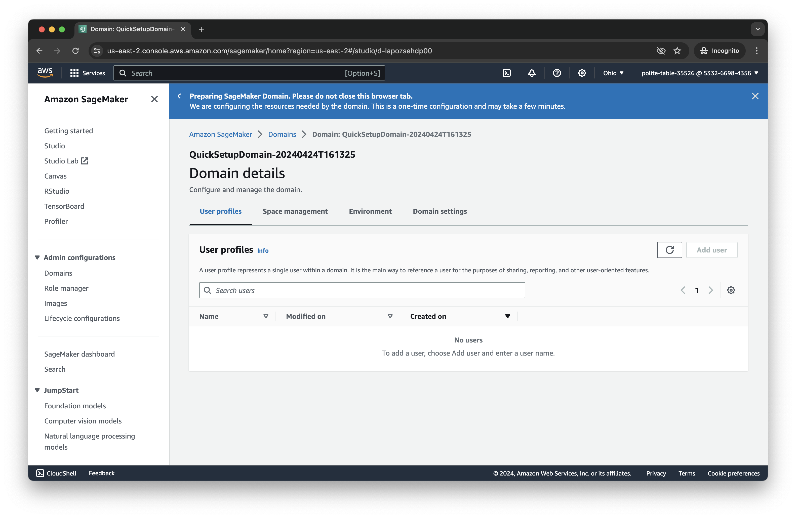

Once it finishes, you'll see a message saying "The SageMaker Domain is ready."  Next to the default user, click "Launch" 

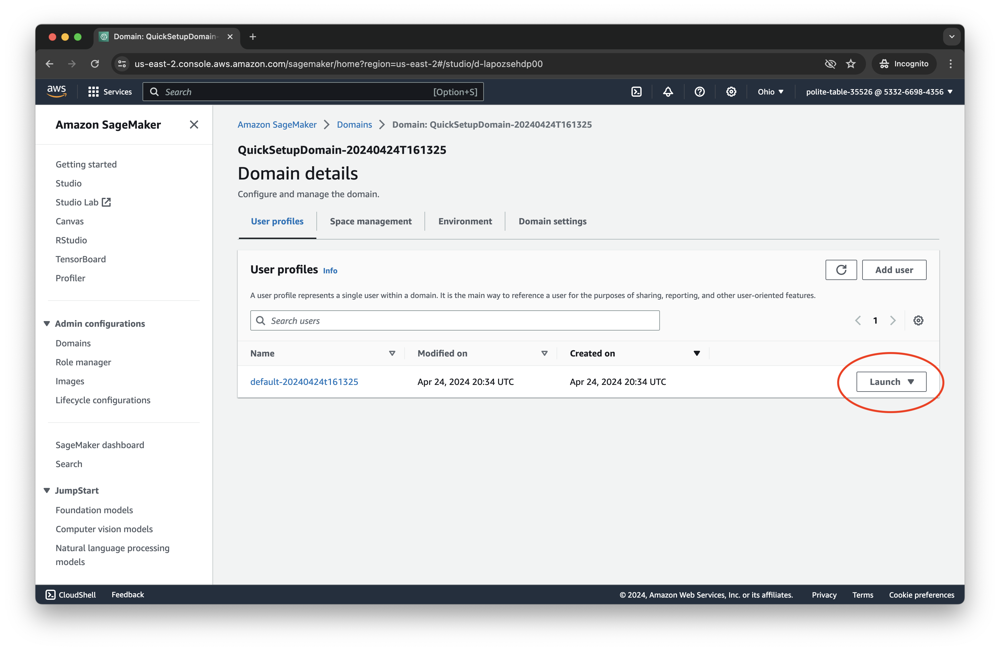

Then select "Studio" under that.  You'll be put through a few redirects.

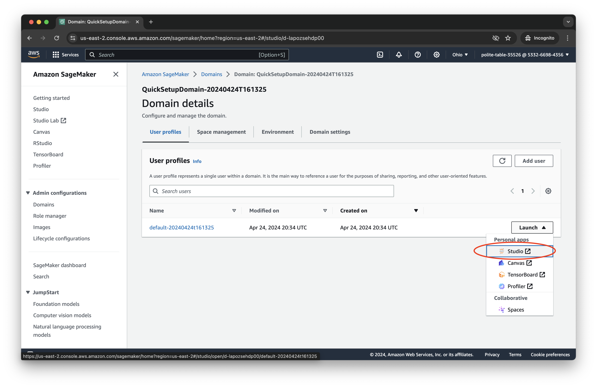

Click on the button with orange background - "JupyterLab".

From the top right, click on "Create JupyterLab Space" button.

Provide a name for your JupyterLab space, perhaps "sec-edgar."

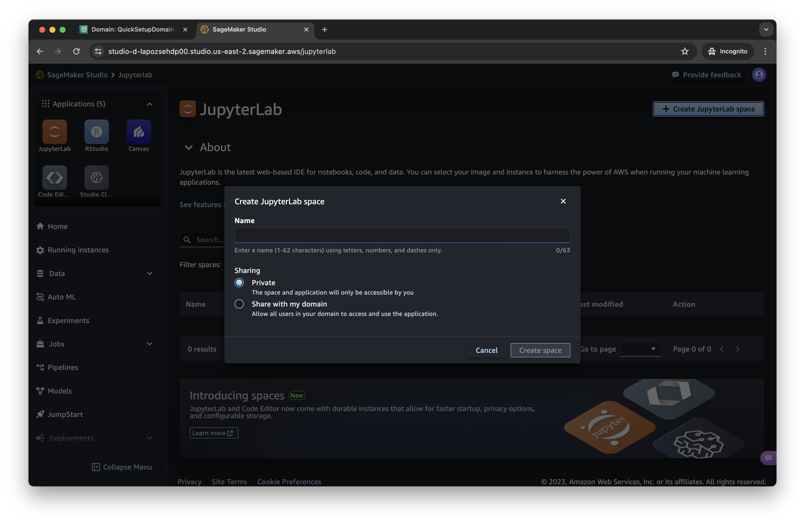

 and click "Create Space"

You will be landing in the page below. Wait for a few seconds to see the "Run space" button enabled.

Click the "Run space" button.

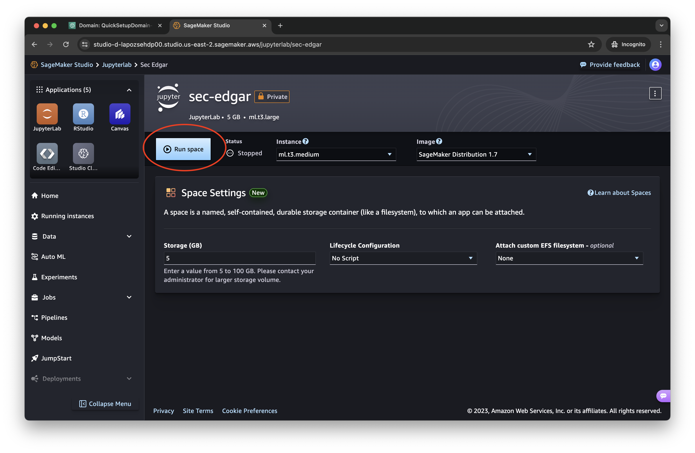

After a couple of minutes, you will see the space created and the "Open JupyterLab" button enabled. Click that button which will open a new window.

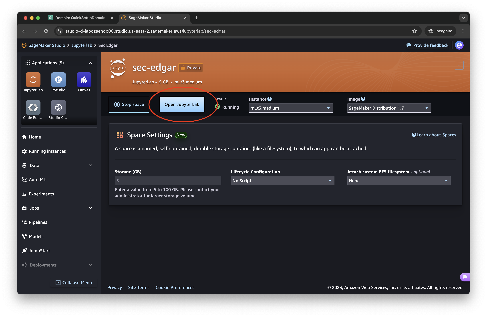

When the window is loaded, you'll land in SageMaker Studio.  This is Amazon's hosted notebook environment.

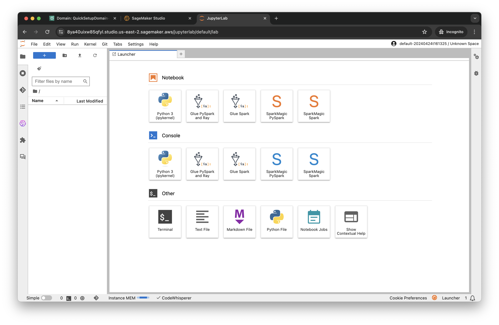

## Import from GitHub to SageMaker Studio
For the rest of the labs, we're going to be working with notebooks in SageMaker Studio.  To load them into Studio, we're going to pull them from GitHub using Studio's git integration.

Click on the git icon in the upper left of Studio.  It's below the folder icon on the extreme left of the menu.

Now click "Clone a Repository."

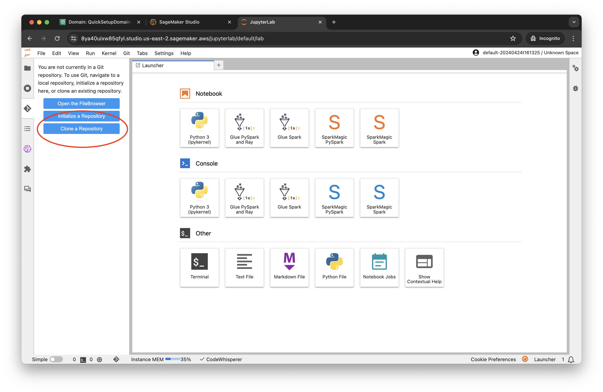

In the dialog, enter the address of the git file in the repo we've been working with.  That is:

    https://github.com/neo4j-partners/hands-on-lab-neo4j-and-bedrock.git

Then click "Clone."

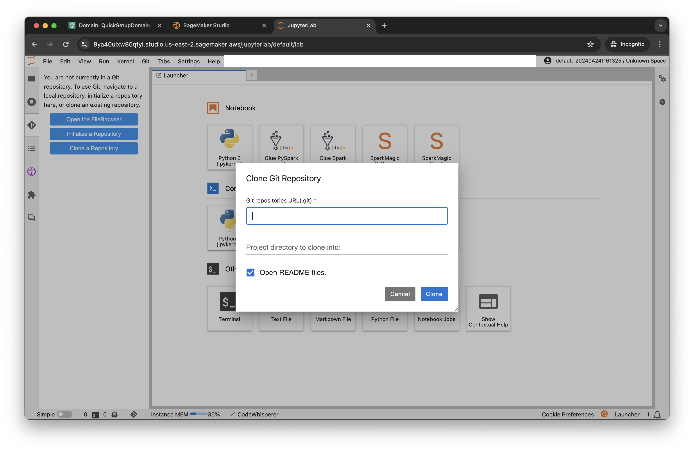

When complete, it will open the README.md for this repo.  In the file explorer on the left, double click on "Lab 5 - Parsing Data."  

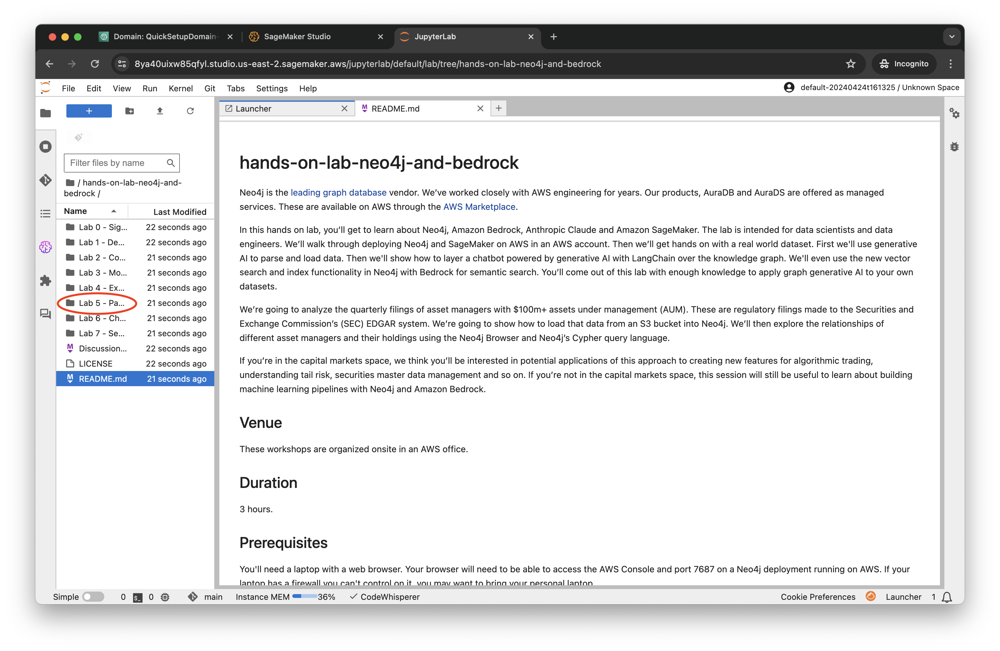

Click on "parsing-data.ipynb" to open it.

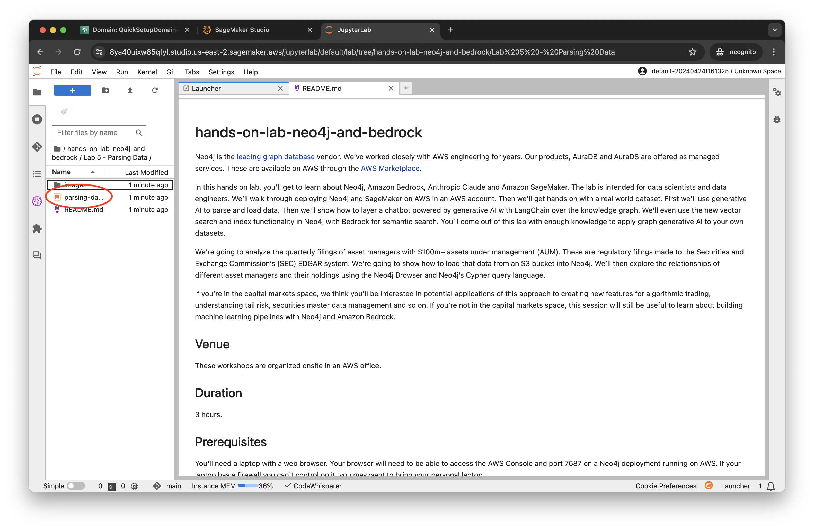

Keep the default kernel and click "Select." 

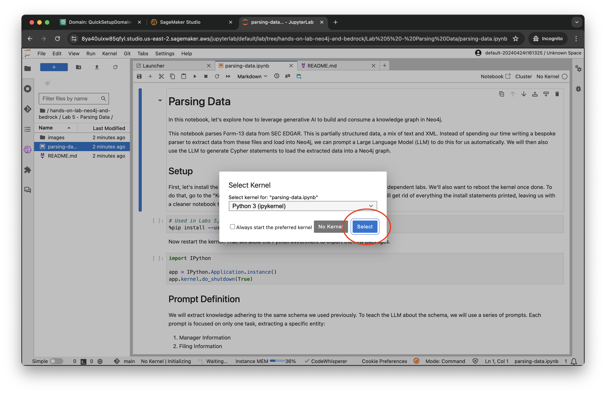

Once complete, you should see this.  Now you're all ready to run through this notebook!  To do so, select a cell and then press the play button.  That runs the cell.  You can now work through the notebook running each cell.

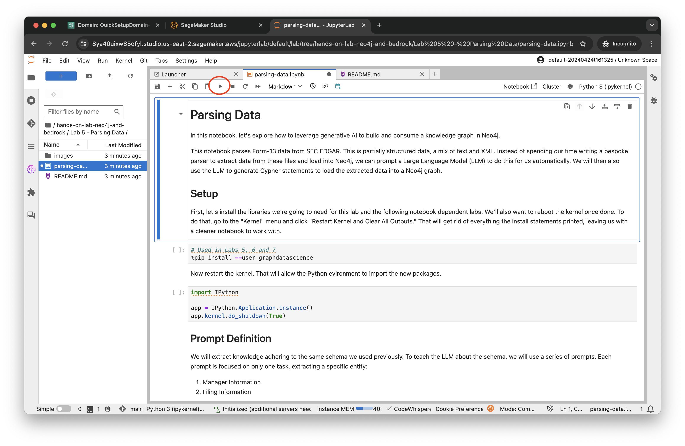

In the next labs, we'll explore further, following this same approach of running through notebooks for each lab.

#### Progress:  █████░░ 5/7 Labs Completed!
