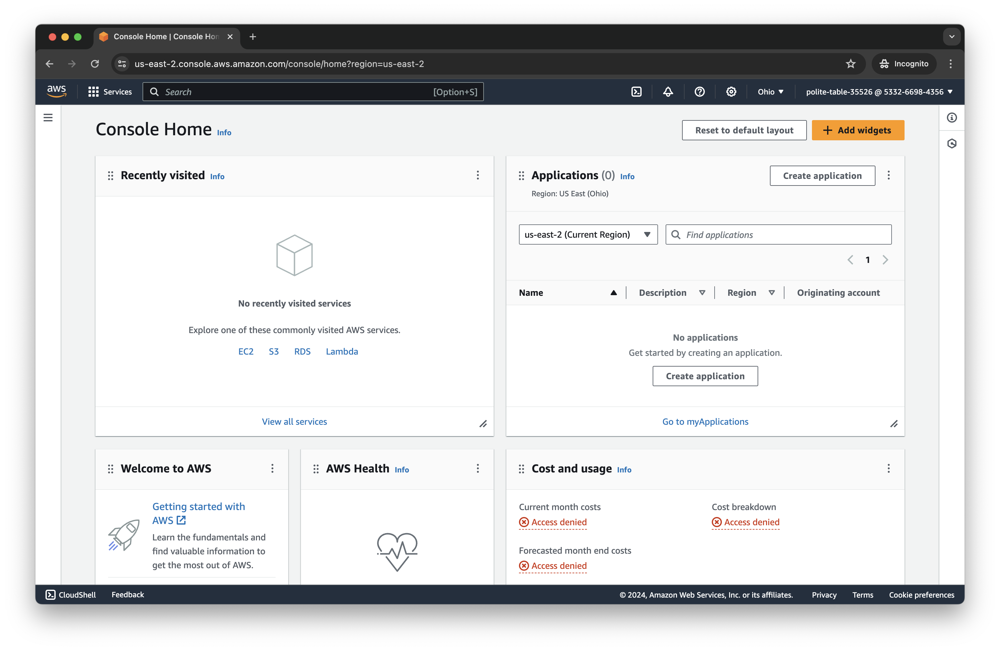
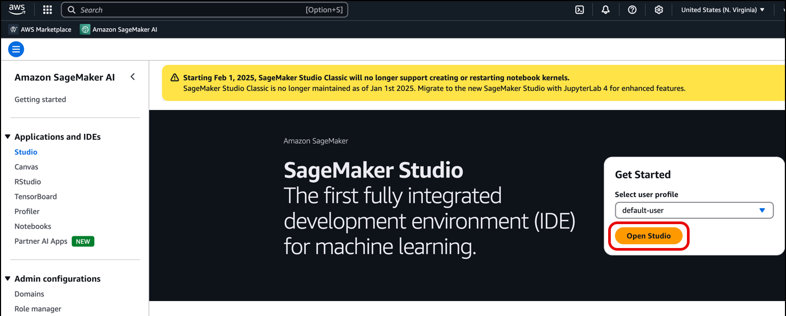
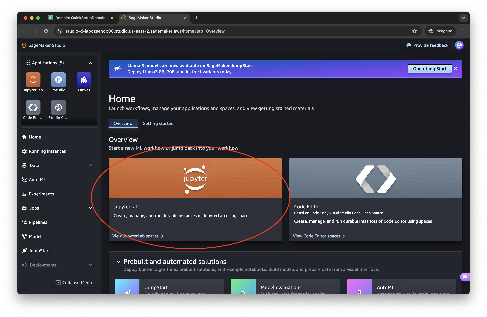
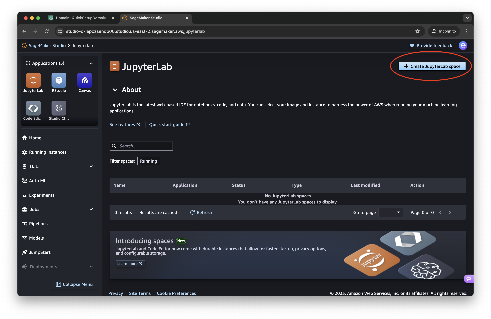
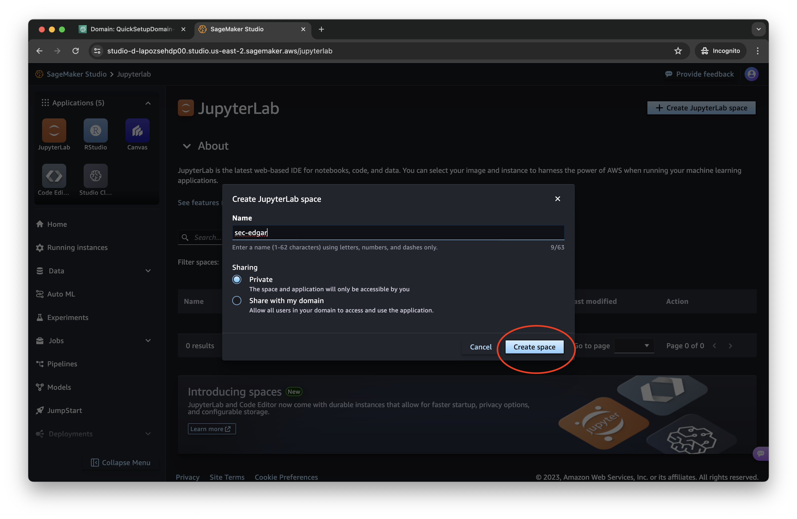

# Lab 5 - Parsing Data
In this lab we're going to spin up a SageMaker domain.  We'll then use it to run a notebook that calls Neo4j and Amazon Bedrock APIs to load data into Neo4j.

## Create a SageMaker Domain
The first step is to deploy a SageMaker domain.  To do that, open the AWS console [here](https://console.aws.amazon.com/).  In the search bar, type "sagemaker." 

From the search results, click on "SageMaker Studio" under "Top Features".

Click "Set up for single user."

You'll see a message that the domain is being set up.  Wait for that to complete.  It takes a while.  Mine took six minutes to complete.

Once it finishes, you'll see a message saying "The SageMaker Domain is ready."  Next to the default user, click "Launch" and select "Studio" under that.  You'll be put through a few redirects.

If the default user isn't shown, you may need to refresh the screen.

Then the environment will spend some more time provisioning.  It took me four minutes.  If prompted to "Keep waiting" or "Clear the workspace," choose to wait.

When complete, you'll land in SageMaker Studio.  This is Amazon's hosted notebook environment.

## Import from GitHub to SageMaker Studio
For the rest of the labs, we're going to be working with notebooks in SageMaker Studio.  To load them into Studio, we're going to pull them from GitHub using Studio's git integration.

Click on the git icon in the upper left of Studio.  It's below the folder icon on the extreme left of the menu.

Now click "Clone a Repository."

In the dialog, enter the address of the git file in the repo we've been working with.  That is:

    https://github.com/neo4j-partners/hands-on-lab-neo4j-and-bedrock.git

Then click "Clone."

This menu is a little finicky.  On my machine, I had to click on the URL after I pasted it and then click the "Clone" button.  If I didn't I receveived an error.

When complete, it will open the README.md for this repo.  In the file explorer on the left, double click on "Lab 5 - Parsing Data."  Click on "parsing-data.ipynb" to open it.

For image, select "Data Science 3.0."  That will populate the kernel and so on.

Click "Select."

You'll see a message that the kernel is starting.  It takes a while.  In my case, it was three minutes to start.  Once complete, you should see this.  Now you're all ready to run through this notebook!

In the next labs, we'll explore further with notebooks.